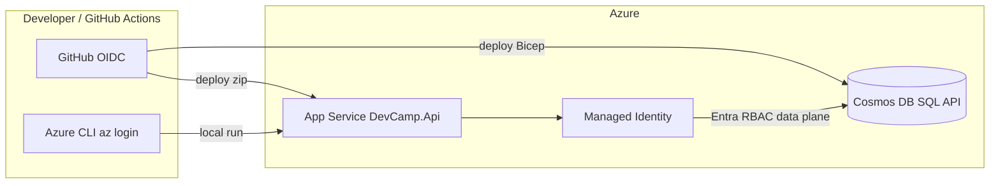

# Architecture (modern path)

| Layer | Location | Notes |
|-------|----------|--------|
| Legacy reference | `legacy/` | .NET Framework, keys in config — **do not extend** |
| Modern API | `modern/dotnet/DevCamp.Api` | ASP.NET Core 8, Cosmos SDK v3, RBAC |
| IaC | `infra/` | Bicep; Cosmos `disableLocalAuth` |
| Automation | `.github/workflows/` | CI, infra deploy, API deploy |
| Teaching | `playbooks/prompts/` | Ordered AI prompts |

Authentication to Cosmos uses **Entra ID** only on the modern path. Control-plane deployment uses the GitHub federated app registration or your user account via Azure CLI.
